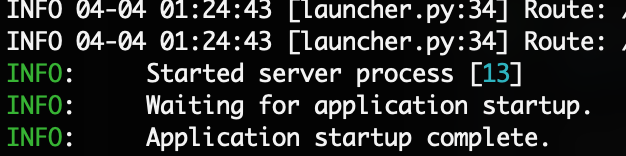
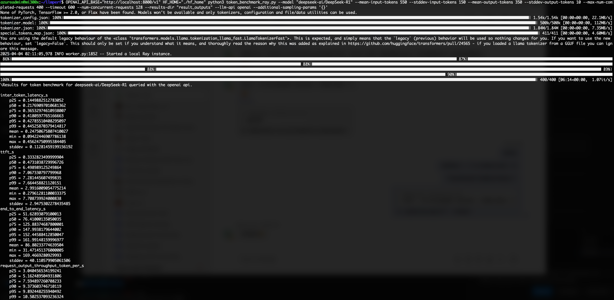
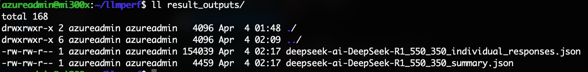

# Create AMD MI300x VM in Azure

This repository contains scripts and configuration files to create an AMD MI300x virtual machine in Azure. The setup includes configuring NVMe storage, Docker, and environment variables for optimal performance.

## Prerequisites

1. **Azure CLI**: Ensure you have the Azure CLI installed and authenticated. You can download it [here](https://learn.microsoft.com/en-us/cli/azure/install-azure-cli).
2. **SSH Key**: Generate an SSH key pair if you don't already have one. Place the public key in the `pub_ssh_key` file.
3. **Azure Subscription**: Ensure you have an active Azure subscription with sufficient quota for the `Standard_ND96isr_MI300X_v5` VM size.
   - To check your quota, run the following Azure CLI command:
     ```sh
     az vm list-usage --location westus --output table |grep MI300X
     ```
   - Look for the "NDv5 Series" quota and ensure it meets the requirements for the `Standard_ND96isr_MI300X_v5` VM size.

## Files in this Repository

- **`cloud-init.yaml`**: Cloud-init configuration file for setting up NVMe storage, Docker, and environment variables.
- **`create_vm.sh`**: Bash script to create the VM in Azure using the Azure CLI.
- **`pub_ssh_key`**: File to store the public SSH key used for VM authentication.
- **`README.md`**: Documentation for the repository.

## Steps to Create the VM

1. Clone this repository:
   ```sh
   git clone <repository-url>
   cd azure-mi300x
   ```

2. Add your public SSH key to the `pub_ssh_key` file:
   ```sh
   echo "your-public-ssh-key" > pub_ssh_key
   ```

3. Run the `create_vm.sh` script:
   ```sh
   chmod u+x create_vm.sh
   ./create_vm.sh
   ```

   This script will:
   - Create a resource group in the `westus` region.
   - Deploy an AMD MI300x VM with the specified configuration.
   - Apply the `cloud-init.yaml` configuration to set up the VM.

## Cloud-Init Configuration

The `cloud-init.yaml` file performs the following tasks:
- Updates the package list.
- Configures NVMe storage as a RAID 0 array and mounts it to `/mnt/resource_nvme`.
- Sets up Docker with a custom data root on the NVMe storage.
- Configures environment variables for Hugging Face cache.

## Verifying the Setup

1. SSH into the VM:
   ```sh
   ssh azureadmin@<vm-ip-address>
   ```

2. Verify NVMe storage:
   ```sh
   df -h | grep /mnt/resource_nvme
   ```

3. Check Docker configuration:
   ```sh
   docker info | grep "Docker Root Dir"
   
   ```
## Running SG Lang server with DeepSeek R1

```sh
docker pull rocm/sgl-dev:upstream_20250312_v1
docker run \
  --device=/dev/kfd \
  --device=/dev/dri \
  --security-opt seccomp=unconfined \
  --cap-add=SYS_PTRACE \
  --group-add video \
  --privileged \
  --shm-size 32g \
  --ipc=host \
  -p 30000:30000 \
  -v /mnt/resource_nvme:/mnt/resource_nvme \
  -e HF_HOME=/mnt/resource_nvme/hf_cache \
  -e HSA_NO_SCRATCH_RECLAIM=1 \
  -e GPU_FORCE_BLIT_COPY_SIZE=64 \
  -e DEBUG_HIP_BLOCK_SYN=1024 \
  rocm/sgl-dev:upstream_20250312_v1 \
  python3 -m sglang.launch_server --model deepseek-ai/DeepSeek-R1 --tp 8 --trust-remote-code --chunked-prefill-size 131072  --torch-compile-max-bs 256 --host 0.0.0.0 
```
 Once the application outputs “The server is fired up and ready to roll!”, you can begin making queries to the model. 

 ```sh
 curl http://localhost:30000/get_model_info 
{"model_path":"deepseek-ai/DeepSeek-R1","tokenizer_path":"deepseek-ai/DeepSeek-R1","is_generation":true}
```
```sh 
curl http://localhost:30000/generate -H "Content-Type: application/json" -d '{ "text": "Once upon a time,", "sampling_params": { "max_new_tokens": 16, "temperature": 0.6 } }'
 ```
## Running VLLM server with DeepSeek R1, benchmark with llmperf
### running vllm with deepseek R1
```
docker run -it --rm --ipc=host --network=host --group-add render \
    --privileged --security-opt seccomp=unconfined \
    --cap-add=CAP_SYS_ADMIN --cap-add=SYS_PTRACE \
    --device=/dev/kfd --device=/dev/dri --device=/dev/mem \
    -e VLLM_USE_TRITON_FLASH_ATTN=1 \
    -e VLLM_USE_AITER=1 \
    -e  VLLM_MLA_DISABLE=0 \
    rocm/vllm-dev:main

(inside the container)


export VLLM_USE_TRITON_FLASH_ATTN=0
export NCCL_MIN_NCHANNELS=112
vllm serve deepseek-ai/DeepSeek-R1 \
--disable-log-requests \
--tensor-parallel-size 8 \
--trust-remote-code \
--max-model-len 32768 \
--enable-chunked-prefill=False \
--max-num-seqs 1024 \
--max-seq-len-to-capture 16384 \
--port=8000
```
**NOTE**: max value of max-model-len is 32768 for now, ref: https://github.com/ROCm/vllm/blob/v0.8.2%2Brocm/docs/dev-docker/README.md#running-deepseek-v3-and-deepseek-r1 , or you will see error like"Memory access fault by GPU node-8 (Agent handle: 0xd40ed30) on address 0x7f36704c0000. Reason: Unknown.
"

wait until you see <br>

### Benchmark with llmperf
1. install [llmperf](https://github.com/ray-project/llmperf)
```
git clone https://github.com/ray-project/llmperf.git
cd llmperf
pip install -e .
```
2. run benchmark (Below example assume running benchmark in the same server, replace <b>"localhost"</b> with correct server if you run benchmark in remote server)
```
mkdir ./hf_home
OPENAI_API_BASE="http://localhost:8000/v1" HF_HOME="./hf_home" python3 token_benchmark_ray.py \
--model "deepseek-ai/DeepSeek-R1" \
--mean-input-tokens 550 \
--stddev-input-tokens 150 \
--mean-output-tokens 350 \
--stddev-output-tokens 10 \
--max-num-completed-requests 400 \
--timeout 600 \
--num-concurrent-requests 128 \
--results-dir "result_outputs" \
--llm-api openai \
--additional-sampling-params '{}'
```
then you should able see result in result_outputs folder.


## Cleanup

To delete the resource group and all associated resources:
```sh
az group delete --name mi300x --yes --no-wait
```
## Reference
1. [Running DeepSeek-R1 on a single NDv5 MI300X VM](https://techcommunity.microsoft.com/blog/azurehighperformancecomputingblog/running-deepseek-r1-on-a-single-ndv5-mi300x-vm/4372726)
2. [Supercharge DeepSeek-R1 Inference on AMD Instinct MI300X](https://rocm.blogs.amd.com/artificial-intelligence/DeepSeekR1-Part2/README.html)
3. [vllm FP8 Latency and Throughput benchmarks with vLLM on the AMD Instinct™ MI300X accelerator](https://github.com/ROCm/vllm/blob/main/docs/dev-docker/README.md)
4. [Serving LLMs on AMD MI300X: Best Practices](https://blog.vllm.ai/2024/10/23/vllm-serving-amd.html)

## License

This project is licensed under the MIT License. See the LICENSE file for details.
